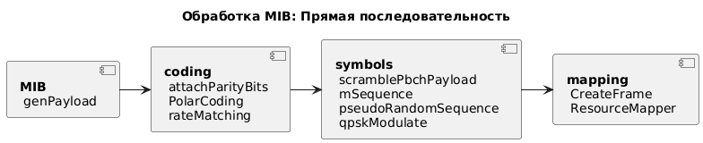

## Transmitter

## MIB 

Master information block - главный информационный блок.     

Этот блок содержит 23 бита. К этому блоку в начало потока добавляется бит, указывающий, что далее следует MIB, а в конец – обязательная часть нагрузки, такая как номер системного кадра (SFN) и другие параметры, зависящие от типа размещения блоков на ресурсной сети. На этом этапе длина потока составляет 32 бита.  
Этот набор бит перемежается и скремблируется (рандомизируется).  
К полезной нагрузке добавляется 24 бита CRC – для выявления ошибок на приёмной стороне. После чего перемежаются.  
К этой последовательности применяется помехоустойчивое полярное кодирование, увеличивающее длину потока до 512 бит. После этого происходит поблочное перемежение.  
Поскольку стандарт предусматривает другие возможные длины сообщений, а как следствие другие длины потоков на данном этапе, а ресурсные элементы, выделенные для информационных данных PBCH, подразумевают поток длиной 864 бита, выполняется согласование скоростей битовых потоков. После этого проводится ещё одно скремблирование.

Графисчески последовательность алгоритмов изображена здесь:   

 
 