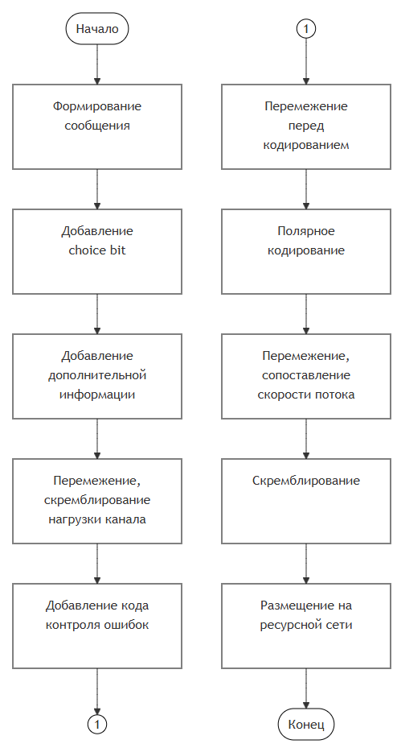
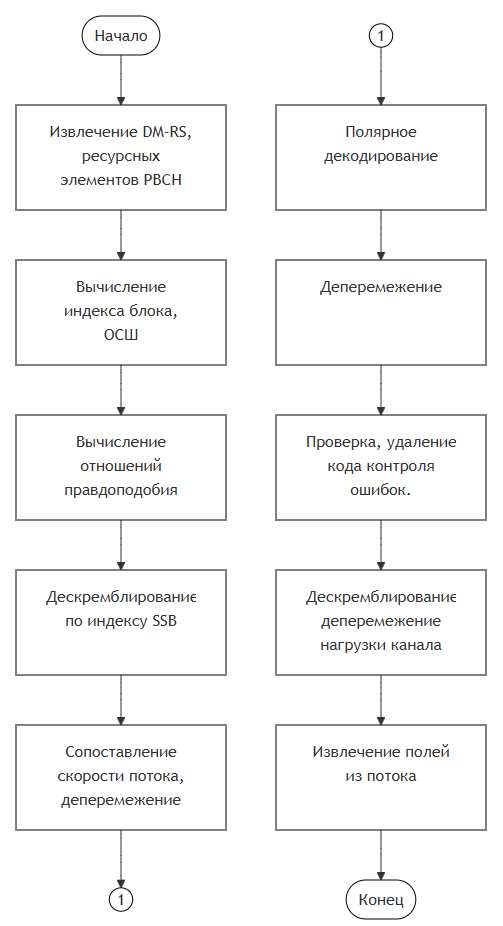

## PBCH Model 5G

## Receiver

## Состав PBCH:  
Блоки синхронизационных каналов (SSB). Каждый блок состоит из четырёх основных частей: первичный сигнал синхронизации (PSS), определяемый базовой станцией и определяющий этот параметр для мобильного терминала; вторичный сигнал синхронизации (SSS),однозначно доопределяющий идентификатор; опорный сигнал демодуляции (PBCH DM-RS);  
  
Несёт в себе такую информацию: ак номер кадра, полукадра, индекс блока синхронизации в этом кадре, а также информацию о расположении в ресурсной сети блока «System Information Block» (SIB) с информацией о конфигурации сети.  
  
Блоки синхронизации объединены в пачки. Блоки в пачке могут излучаться излучаются в разных направлениях [8] для систематического сканирования области покрытия базовой станции. 

Графически последовательность алгоритмов изображена здесь:   
**Схема алгоритмов передачи**:  
  
**Схема алгоритмов приёма**:  
  
  
  
  
  
  
Разбор схемы алгоритмов приёма:   
### OFDM - демодулятор      
С его помощью получаем ресурсную сетку в виде матрицы комплексных чисел  
В данном блоке используются функции:     
ofdmDemodulator  

### Извлечение DM-RS, ресурных элементов PBCH  
В данном блоке используются функции:   
parseSsb  
  
  
  
### Вычисление индекса блока, ОСШ  
В данном блоке используются функции:   
extractBlockIndex  
  
### Вычисление отношений правдоподобия.  
В данном блоке используются функции:   
pbchLikehood
  
### Дескремблирование по индексу SSB.  
В данном блоке используются функции:   
scramblePbch    

### Сопоставление скорости потока, деперемежение.  
В данном блоке используются функции:   
rateRecovery  

### Полярное декодирование.  
В данном блоке используются функции:     
polarDecoding
  
  
### Деперемежение.  
В данном блоке используются функции:     

  
### Проверка, удаление кода контроля ошибок.  
В данном блоке используются функции:  
verifyParity  

### Дескремблирование, деперемежение нагрузки канала.  
В данном блоке используются функции:  
descramblePbchPayload, descramblePbch, deinterleavePbchPayload,   
deinterleave, subBlockDeinterleaving (внутренние функции)
  
### Извлечение полей из потока.  
В данном блоке используются функции:  
parsePayload 

