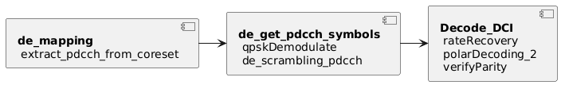

#
**Receiver (приемник)**
##
**DCI**
###
**Декодирование полезной нагрузки DCI**

Обработка DCI складывается из извлечения данных с ресурсной сетки и их обработке в порядке обратном приведенному в разделе "Кодирование полезной нагрузки DCI". В nrPbchModel декодирование DCI реализовано как указано на схеме:

