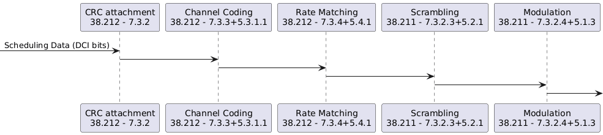
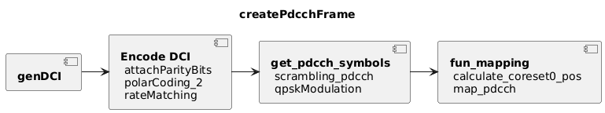

#
**Transmitter (передатчик)**
##
**DCI**
**Генерация полезной нагрузки DCI**

DCI (Downlink Control Information) — это информация управления нисходящим каналом в 5G сетях, которая передаёт ключевые данные для планирования и распределения физических ресурсов. Блок DCI передается по каналу PDCCH.
Форматы DCI определены стандартом 3GPP TS 38.212. В модели реализован формат 1_0, скремблируемый SI-RNTI, используемый для передачи SIB.Разделом 7.3.1.2. стандарта для данного формата определен следующий набор полей:
1. Frequency domain resource assignment - переменной длины, зависит от размера блока CORESET0.
2. Time domain resource assignment - 4 бита, определены в 5.1.2.1 TS 38.214.
3. VRB-to-PRB mapping - 1 бит, определен в TS 38.212.
4. Modulation and coding scheme - 5 бит, определены в 5.1.3 TS 38.214.
5. Redundancy version -  2 бита, определен в TS 38.212.
6. System information indicator - 1 бит, определен в TS 38.212.
7. Reserved bits - 17 или 15 бит в зависимости от диапазона частот.

###
**Кодирование полезной нагрузки DCI**

Полученный битовый поток подвергается кодированию, состоящему из нескольких этапов:

###
**Нанесение на ресурсную сетку**

Положение ресурсов DCI на ресурсной сетке определяется положением набора управляющих ресурсов CORESET0 (Cоntrol Resource Set), положение которого в свою очередь определяется из содержания сообщения MIB (Master Information Block). Положение определяется относительно блоков синхронизации с помощью спецификации TS 38.213. Для определения положения в частотной области используется параметр pdcch-ConfigSIB1.Нанесение на ресурсную сетку реализовано в fun_mapping.

Полный цикл обработки DCI и нанесение на ресурсную сетку:

