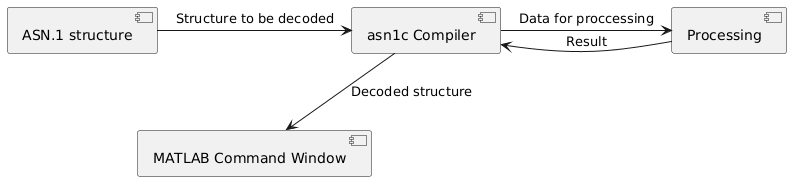

#
**SIB1**

System Information Block 1 – системное сообщение, передающееся в широковещательном режиме и содержащее системные идентификаторы соты. Для передачи используется канал PDSCH.
##
**Структура сообщения и PER кодирование**

Стандартом TS 38.331 6.2.2 SIB1 задан в виде ASN.1 структуры. Для корректной реализации кодирования использован компилятор asn1c, преобразующий код ASN.1 в С код.Компилятор asn1c генерирует функции для кодирования и декодирования заданной структуры. Подключение к MATLAB реализовано с помощью mex-функций с применением MATLAB API.
В модели реализованы обязательные поля (сохранен опциональнынй параметр - MCC(Mobile Country Code).

##
**Реализация и модификация структуры**

 Изменения структуры производятся в SIB1.asn1. При добавлении нового поля в структуру необходимо заново генерировать С-файлы и объединять их в библиотеку (в модели - libsib1.so). Для подключения динамической библиотеки в MATLAB необходимо указать путь к ней явно. Перед запуском MATLAB в терминале указать 
```
export LD_LIBRARY_PATH=/путь/к/библиотеке/SIB1/asn1/lib:$LD_LIBRARY_PATH 
```
sib1_encoder_mex.m не принимает параметров из MATLAB и возвращающет закодированные данные. 

sib1_decoder_mex.m принимает данные hex и выводит декодированную структуру.

Инициализация структуры вынесена в cellinfo_init.m. При внесении изменений в структуру потребуются изменения в  sib1_encoder_mex.m, sib1_decoder_mex.m и cellinfo_init.m. После внесения изменений в mex-функции потребуется перекомпиляции. Для перекомпиляции mex-функции sib1_encoder_mex.m и инициализатора cellinfo_init.m в Commamd window выполнить 
```
mex -g -output bin/encoded_sib1 -I/путь/к/заголовочным/файлам/SIB1/asn1/include -L/путь/к/библиотеке/SIB1/asn1/lib -lsib1.so /путь/к/мех/функции/SIB1/asn1/mex/sib1_encoder_mex.c /путь/к/инициализатору/SIB1/asn1/mex/cellinfo_init.c -outdir /путь/для/сохранения/SIB1/asn1/mex -v
```
Здесь encoded_sib1 - имя функции которая будет вызываться как обычная функция MATLAB. Аналогично выполняется перекомпиляция sib1_decoder_mex.m.

##
**Ошибка подключения библиотеки**

При появлении сообщения 
```
Invalid MEX-file '/путь/к//SIB1/asn1/mex/encoded_sib1.mexa64': libsib1.so: cannot open shared object file: No such file or
directory
```
путь к библиотеке нужно указать в MATLAB Command window:
``` 
setenv('LD_LIBRARY_PATH', ['/путь/к/библиотеке:', getenv('LD_LIBRARY_PATH')]);
```
и переместить файл библиотеки в ту же директорию, где расположены mex-функции.

Перевод из шестнадцатиричной системы в двоичную и обратно осуществляется функциями hex_to_bits.m и bits_to_hex.m.

