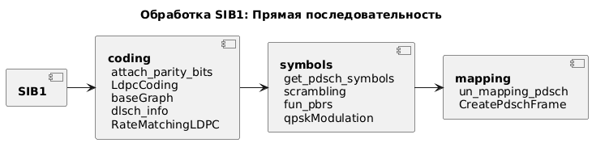
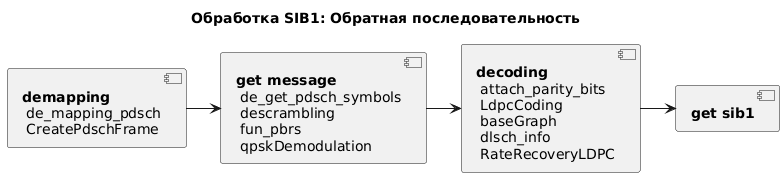

## Transmitter (передатчик)

## Модуль SIB1
SIB1 (system information block) - является ключевым сообщением в сетях 5G, содержащим основную информацию, необходимую устройству для доступа к сети и получения дальнейших конфигурационных данных. Он включает в себя информацию для определения возможности подключения к соте, параметры доступа, идентификаторы сетей (PLMN, TAC) и расписание передачи остальных системных блоков (SIB)  

Передаётся этот сообщение по общему нисходящему каналу (PDSCH). Содержит в себе динамически заданное количество бит, определяемое структурой ASN_C.  
  
**Кодирование**:   
Добавления битов чётности (attach_parity_bits) [TS 38.212, 5.1],   
LDCP кодирования (LdpcCoding, baseGraph, dlsch_info)[TS 38.212, 5.3.2],  
Согласования скорости (RateMatchingLDPC)[TS 38.212, 5.4.2]  

**После чего подвергается операциям**:  
Перемежения (scrambling, fun_pbrs)[7.1.2, TS 38.212],  
Модуляция (qpskModulation)[].  
 
**Маппирование**:
Затем символы PDSCH маппируются на ресурсную сетку (fun_mapping_pdsch); Создаётся фрейм, который позже вкладывается в основной (CreatePdschFrame).  
  
Данные этапы графически:  

## Receiver (приёмник)  
В случае приёма последовательность действий обратная.  
Этапы графически:  
