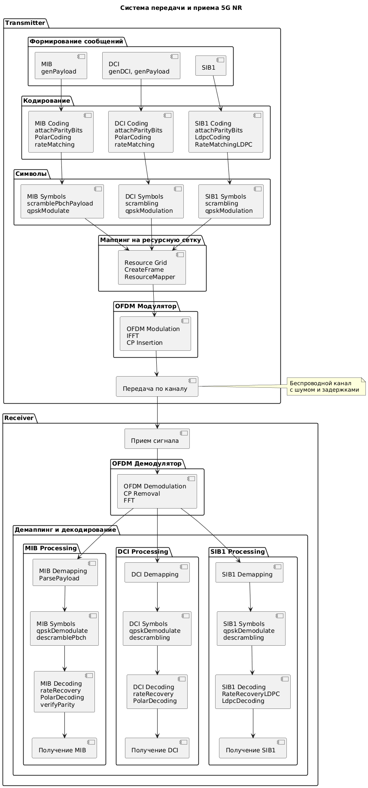
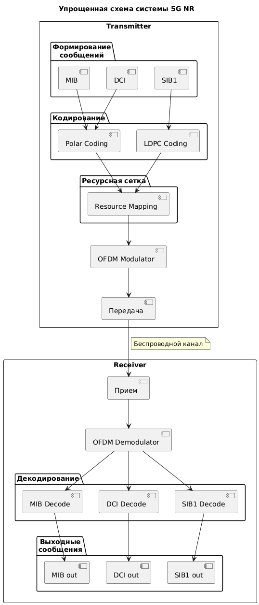
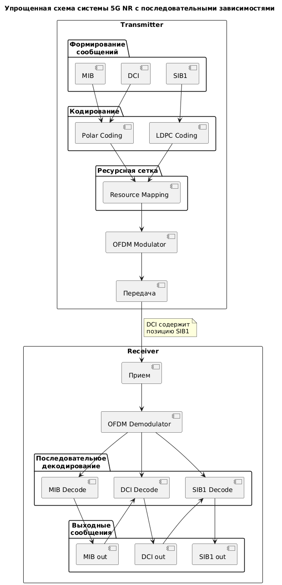

## *Transmitter and Receiver общая схема*  
  
  
  
  
  
Для обращения к каждому модулю приёмно-передающего тракта можно воспользоваться ссылками:   
[ссылка на receiver pbch](pbch_receiver.md)  
[ссылка на transmitter mib](mib_transmitter.md)  
[ссылка на transmitter sib1](sib1_transmitter.md)    
[ссылка на ASN_C sib1](readmy_sib1.md)    
[ссылка на transmitter dci](readmy-dci-transmitter.md)  

[ссылка на receiver mib](mib_receiver.md)  
[ссылка на receiver sib1](sib1_receiver.md)    
s